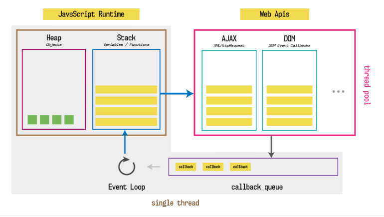

# 创建对象的方式

- 字面量
- new Object()
- new 其他类()

# 对象 key 方括号的使用

- 为什么使用 `[]`
- 这是因为点符号要求 key 是有效的变量标识符
    - 不包含空格，不以数字开头，也不包含特殊字符（允许使用 $ 和 _）；
- 这个时候我们可以使用方括号：
    - 方括号运行我们在定义或者操作属性时更加的灵活；

# 栈内存和堆内存

- 原始类型在栈内存
- 对象类型在堆内存

# 栈堆的一些现象

- 原始类型比较
- 应用类型（对象）比较
- 函数的值传递
- 引用传递，修改地址
- 引用传递，属性修改

# 使用构造函数创建对象 new

- 创建一个空对象
- `this`指向这个空对象
- 执行函数体的代码
- 如果没有明确的返回一个对象，那么 `this` 指向的这个对象会自动返回

# 函数也是对象