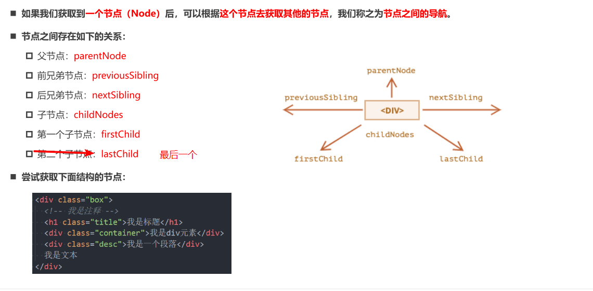

# DOM (Document Object Model)

## DOM 继承关系图

## 节点 `Node` 和 `Element` 的不同

### 节点导航

### 元素导航

### 表格 table 导航

### 表单 form 导航

## 获取元素的方法

## 全局属性 hidden

## 元素的 Attribute 分类

- 标准的 Attribute
- 非标准的 Attribute

### Attribute 操作

## 元素 className 和 classList

## 元素 style 属性

## 元素 style 的读取

- getComputedStyle()

## 插入元素

## 元素大小、滚动

# BOM (Browser Object Model)
