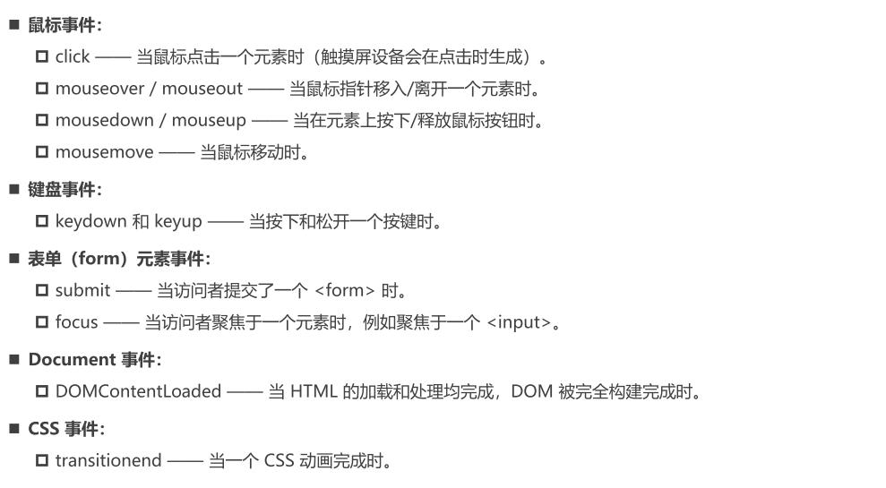
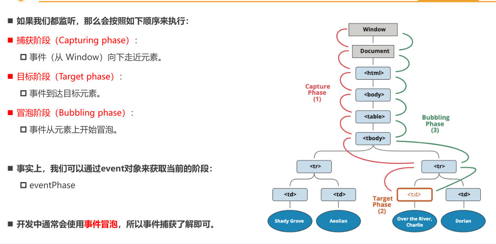
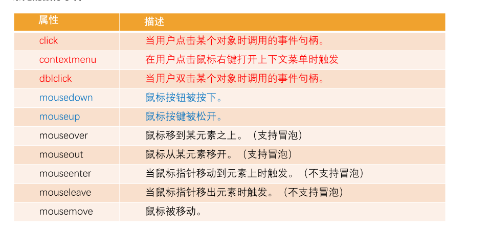

# 常见事件列表

# 事件流

- 当元素点击时，不仅仅点击的是元素本身，其父元素也被点击，一层层向外传递（默认：事件冒泡）

# 事件冒泡

# 事件捕获

- 先捕获，后冒泡

# 事件捕获和冒泡的过程

# 事件对象 （回调函数， event 参数）

- 常见的属性：
    - type：事件的类型；
    - target：**当前事件发生的元素**；
    - currentTarget：**当前处理事件的元素**；
    - eventPhase：事件所处的阶段；
    - offsetX、offsetY：事件发生在元素内的位置；
    - clientX、clientY：事件发生在客户端内的位置；
    - pageX、pageY：事件发生在客户端相对于document的位置；
    - screenX、screenY：事件发生相对于屏幕的位置；

# EventTarget 常见方法

- addEventListener()
- removeEventListener()
- dispatchEvent()

# 事件委托 event delegation

- 原理，利用**事件冒泡**

# 常见的鼠标事件

# 事件参考

- https://developer.mozilla.org/zh-CN/docs/Web/Events